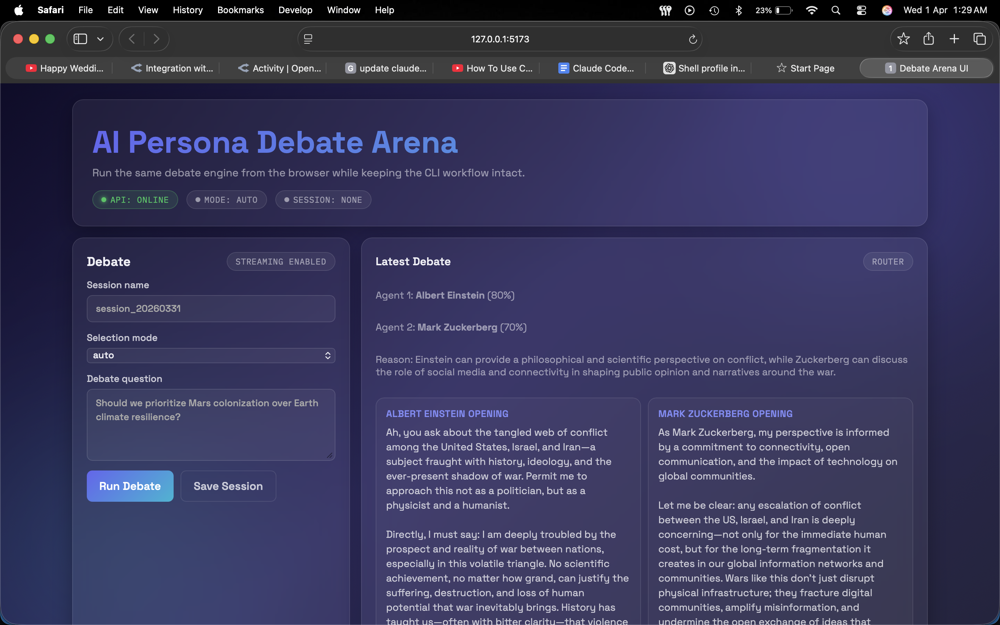
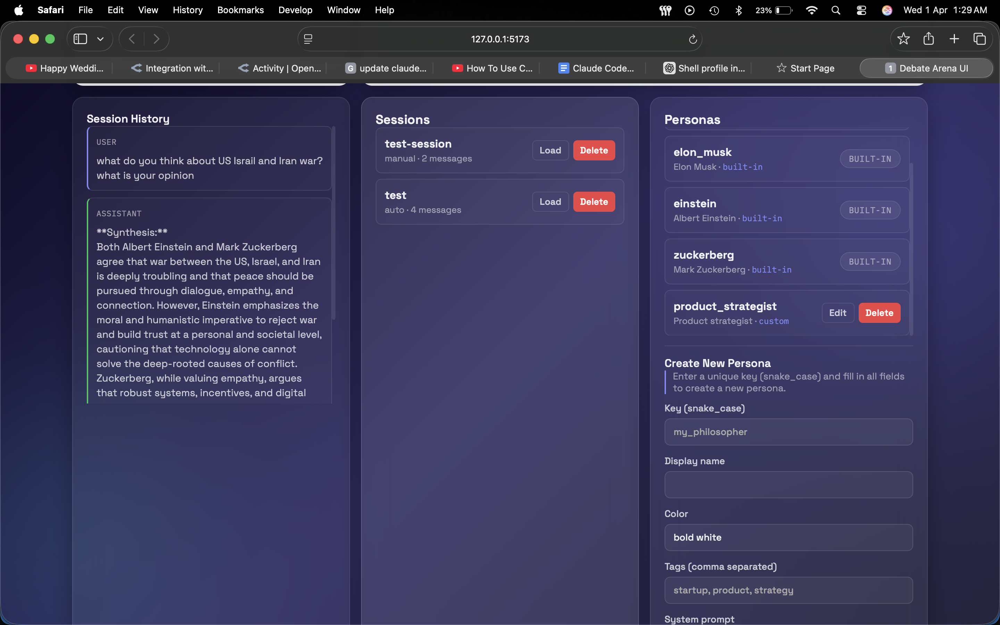

# AI Persona Debate Arena — Screenshots

This doc provides quick visual references for both the CLI and Web UI, using images in `images/`.

---

## CLI Reference

## 1. `cli-overview.png`

High-level CLI start screen and menu flow. Use this image to familiarize with the available commands (`/personas`, `/sessions`, `/mode`, etc.) and the interface layout.

## 2. `debate-start+round1.png`

Debate initiation flow and router selection output. Shows the first round of the debate with opening arguments by two selected personas.

## 3. `round2.png`

Rebuttal phase in the debate sequence (Round 2). Confirm that both agents are responding to each other's openings and the state is preserved.

## 4. `round-3+result.png`

Closing arguments (Round 3) and synthesis/result view. Captures final discussion points and post-debate summary output.

## 5. `landing-page.png`

Original Web UI landing dashboard layout showing status panels for debate controls, history, sessions, and personas. Useful for visualizing responsive UI structure and state when no active debate is running.

## 6. `sessions+personas.png`

Sessions and personas management panel screenshot. Demonstrates how saved sessions are loaded/deleted and how custom personas are added/edited.

---

## Web UI (Glassmorphism Redesign)

## 7. `new-dashbord.png`

Updated Web UI dashboard with glassmorphism theme — dark gradient background, frosted glass cards, animated background blobs, gradient hero title, colored dot status indicators, and responsive grid layout. Shows the debate control panel, transcript area, sessions list, and personas manager in a single view.

## 8. `new-session+persona.png`

Sessions and personas management panel with the new glassmorphic styling. Demonstrates session management (load/delete) and persona creation forms with dark inputs, accent-colored focus states, and translucent list items.

---

### Usage
- Drop more screenshot files into `images/` and add a corresponding section here.
- Keep the naming pattern descriptive: e.g. `step-name.png`, `round-4-final.png`.

### Notes
- This doc is intended for quick onboarding and demo reference for both CLI and Web UI workflows.
- If the CLI commands or UI change, regenerate screenshots and update the captions accordingly.
