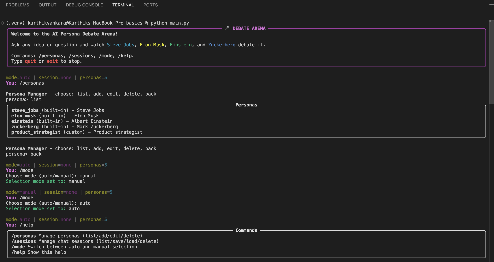
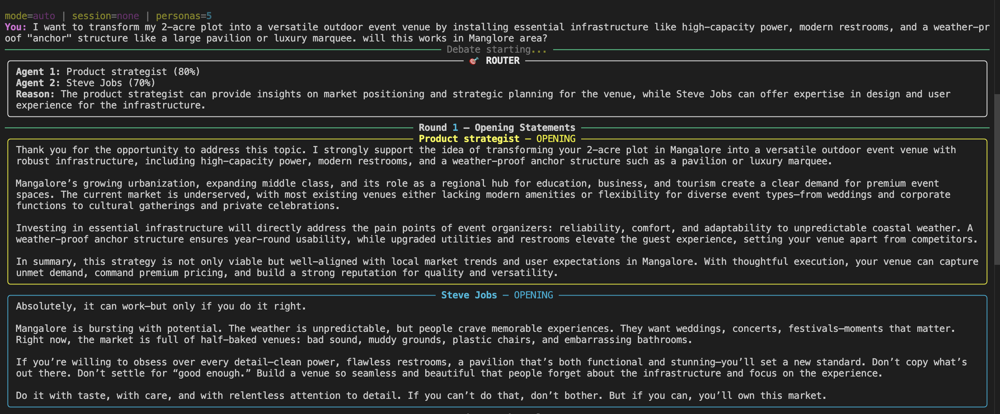
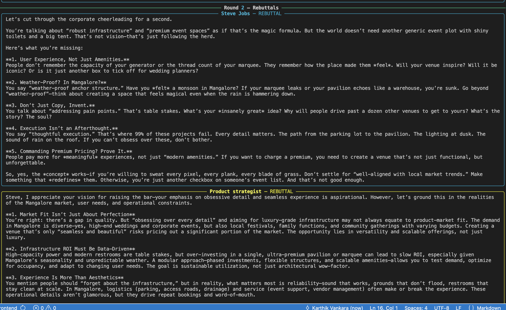
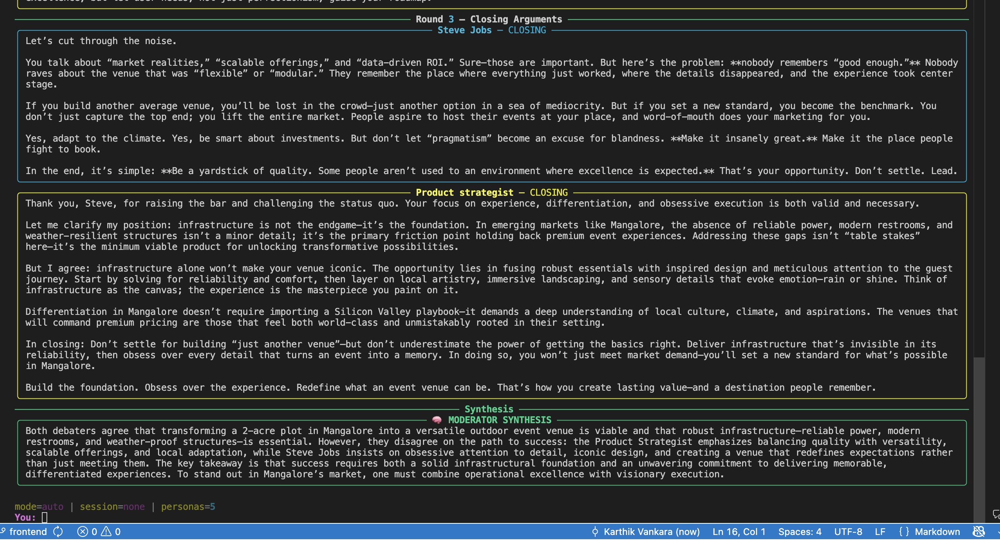
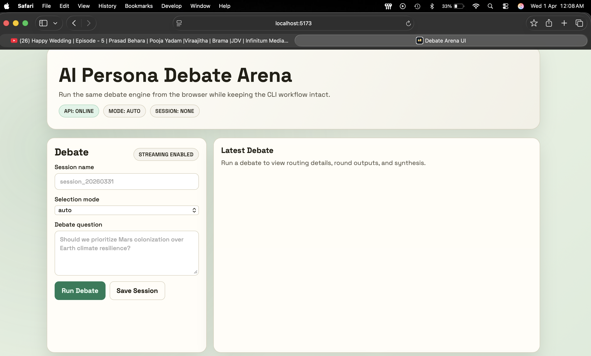
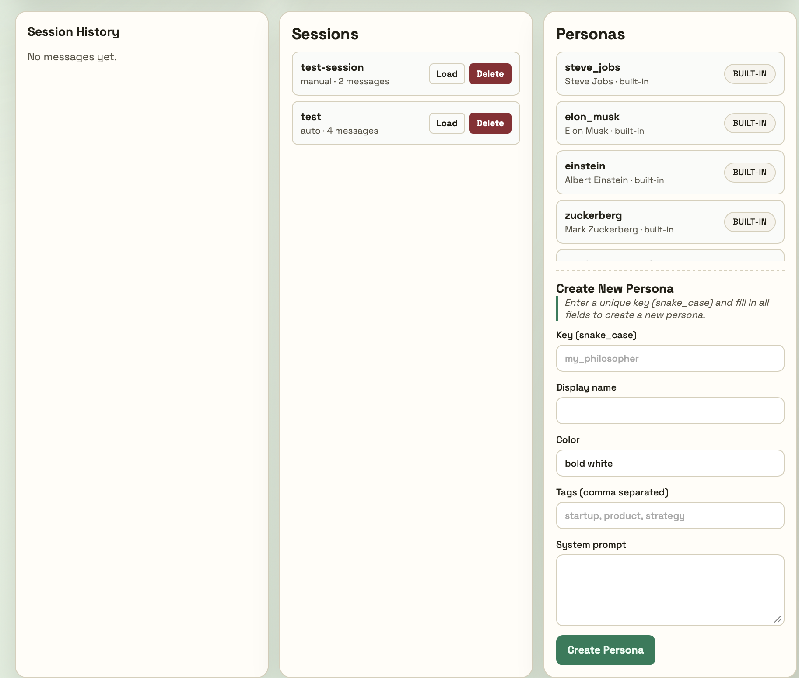

# CLI Images Reference

This doc provides quick visual references to the CLI feature walkthrough using the images in `images/`.

## 1. `cli-overview.png`

High-level CLI start screen and menu flow. Use this image to familiarize with the available commands (`/personas`, `/sessions`, `/mode`, etc.) and the interface layout.

## 2. `debate-start+round1.png`

Debate initiation flow and router selection output. Shows the first round of the debate with opening arguments by two selected personas.

## 3. `round2.png`

Rebuttal phase in the debate sequence (Round 2). Confirm that both agents are responding to each other's openings and the state is preserved.

## 4. `round-3+result.png`

Closing arguments (Round 3) and synthesis/result view. Captures final discussion points and post-debate summary output.

## 5. `landing-page.png`

Overall application landing dashboard layout showing status panels for debate controls, history, sessions, and personas. Useful for visualizing responsive UI structure and state when no active debate is running.

## 6. `sessions+personas.png`

Sessions and personas management panel screenshot. Demonstrates how saved sessions are loaded/deleted and how custom personas are added/edited.

---

### Usage
- Drop more CLI screenshot files into `images/` and add a corresponding section here.
- Keep the naming pattern descriptive: e.g. `step-name.png`, `round-4-final.png`.

### Notes
- This doc is intended for quick onboarding and demo reference for CLI workflow.
- If the CLI commands or UI change, regenerate screenshots and update the captions accordingly.
